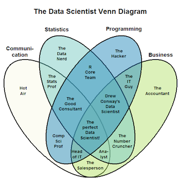
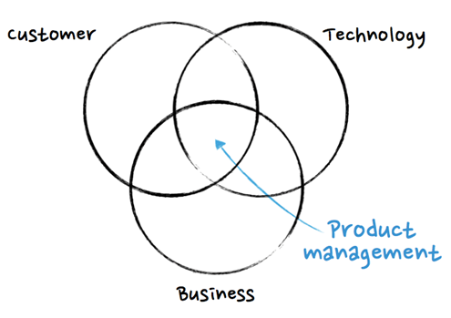
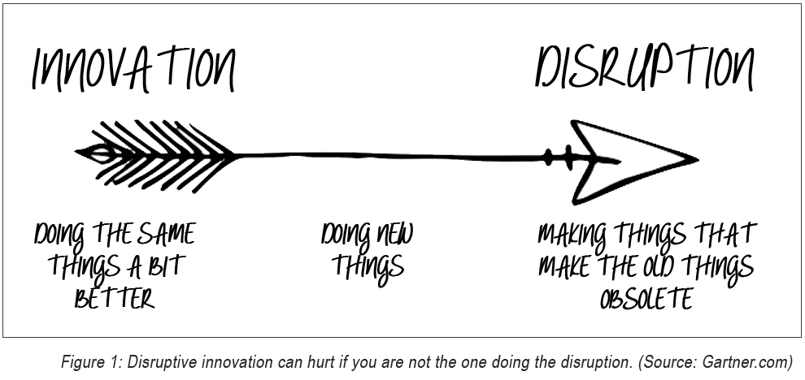

* 10 Years of Experience in Data & Analytics
* 5 Years of Experience in Programming & Computing.
* 4 Years of Experience Leading Projects & Product Design.
* 3 Years of Experience in Data Science.
* Proven Ability to Design & Build Data Science products.

# What I Do

{:style="float: right;margin-right: 7px;margin-top: 7px;"}

I am data science and product management leader currently working in the Minneapolis metro. I have formal training in statistics, am familar with traditional & cutting edge machine learning techniques, and am a capable programmer and data architect. 

There are four core areas of data science that are crucial for success. I have devoted a near equal amount of time to developing myself in these four areas. 

## Communication

## Statistics

[Using Lasso and Ridge Regression for Variable Importance](https://github.com/cbagg/Penalized-Regression)

[Using Clustering to Perform Customer Segmentation](https://github.com/cbagg/Customer-Segmentation-Clustering)

[Using Support Vector Machines to Predict Promotion Effectiveness](https://github.com/cbagg/Orange-Juice-SVM)

[Using ANCOVA and Tukey to Find Optimal Banner Placement](https://github.com/cbagg/Click-Through-Rate-ANCOVA/blob/master/Avazu_Click_Through_Rate_Analysis.md)

## Programming

## Business

# Why I am a Product Manager
{:style="float: left;margin-right: 7px;margin-top: 7px;width: 325px;"}
Like most economics majors, I imagined myself as a business owner; the training prepares one to understand the deep mechanics of pricing, optimization, and forecasting that are crucial. As I grew my career, I learned that most traditional business leaders do very little of this. Deep expertise in the mechanics of the business is often relegated downward to the lower levels of the company. I believe this is the fundamental reason most businesses are rife for disruption. 

Disruptors such as Sergey Brin, Mark Zuckerberg, and Elon Musk have revolutionized their industries because they are fundamentally driven by a deep and abiding understanding of their technology, product, and customers. Many companies have taken a core part of their business, and treated it as a non-critical understanding. Lack of a CPA prevents one from being CFO, but knowledge of technology and data does not bear the same impact to lead technology strategy. I am not satisfied with sitting on the sidelines or staying in my lane. Everything within a product is my lane, and I will drive it to success.

# Why I am a Data Scientist
{:style="float: right;margin-right: 7px;margin-top: 7px;"}
The best way to understand a company is through its data. Data is the method by which you mine insights, with analytics being the application of quantitative methods to strategic thought. Matching algorithms for medical research are used on dating sites, and algorithms from genetics can optimize a stock trading platform. Disruption comes from cross-discipline study, and data science provides an avenue for the application of radical solutions to age old problems.

Numerous times in my career I have seen outsiders provide a solution so radical a departure from the way the business would have otherwise approached it, that its effectiveness is transformational. Survival models typically used in biology research can be leveraged to predict customer churn. Chatbot NLU models can be turned on their head for real time monitoring of EDI feeds. Customer segmentation and social network modeling can be done in a way that finds the optimum sales path to a customer. 

Early in my career I did not consider myself a "science", "math", or "computer" guy, but true business leaders learn all parts of their business and whatever skills are most effective-- and the cutting edge of how businesses compete is now in these fields, and I have adapted to leverage them. 

# What I believe
I manage data scientists and product managers tasked with building great products by understanding the business, the data, and the technology simultaneously. 

I do this by remembering a few core principles. 

* Good solutions and technology exist only with respect to the problems they solve. 
* There is no replacement for competency. Not even leadership skills or attitude.
* A positive attitude is almost always at least one required competency of any task.
* Innovative solutions usually come from unfamilar and even confusing spaces.
* Cohorts of people with expertise always outperform the brilliant loner.
* There is no flag at birth that determines mathematical or technical acumen.
* Intelligence is no substitute for knowledge, which schooling sometimes provides.
* It is impossible to fully understand a problem before trying to solve it.
* It is wise to surround yourself with people who know things you do not.
* Easy work is often not worth doing. Gravitate to the challenge, and fail often.
